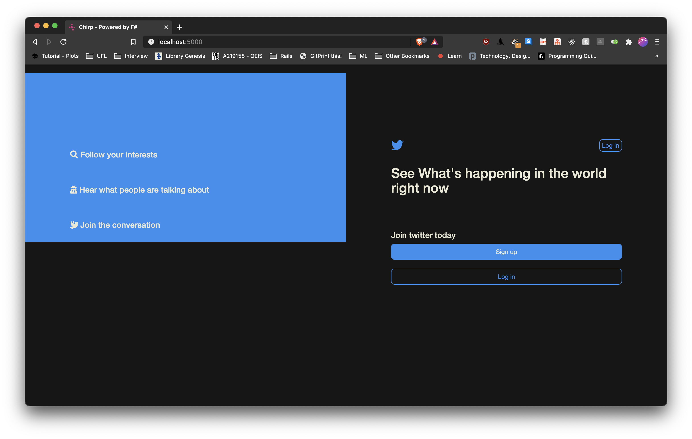
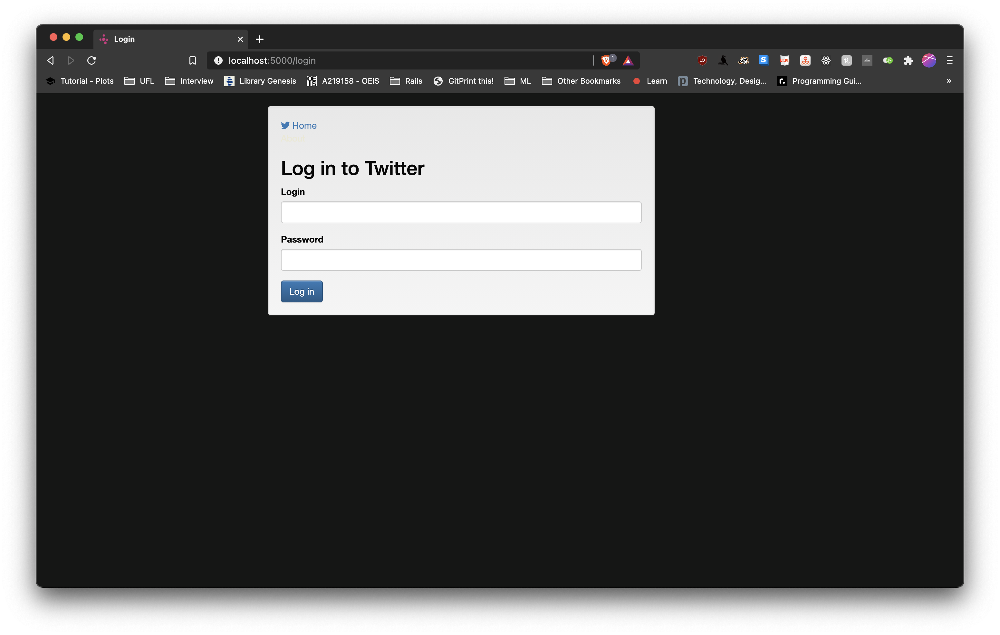
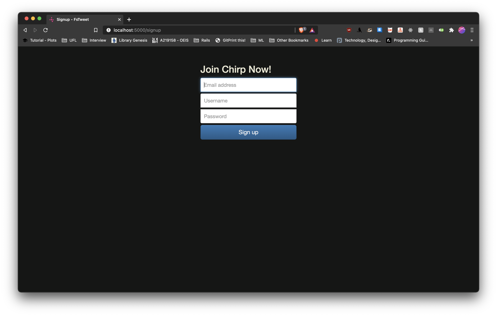
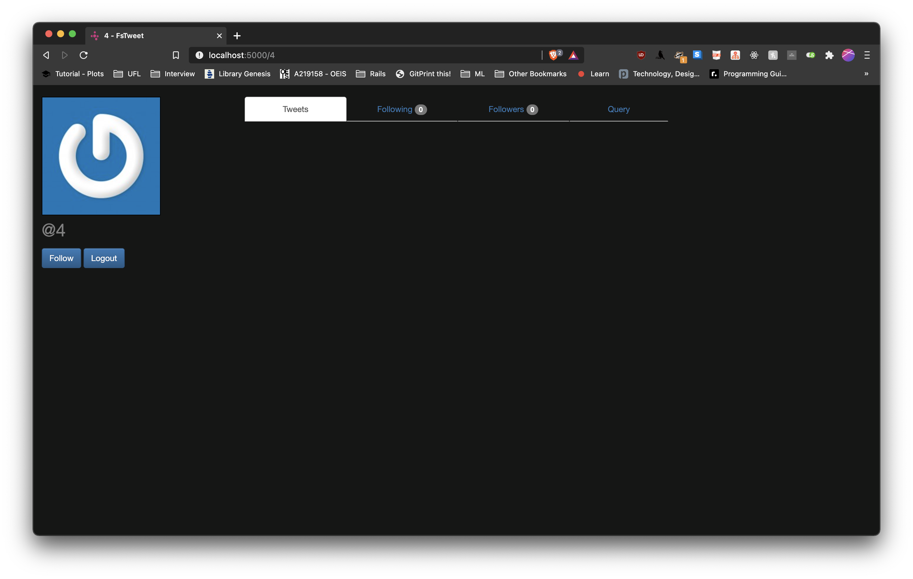
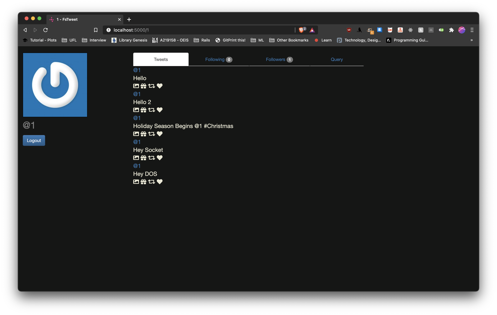
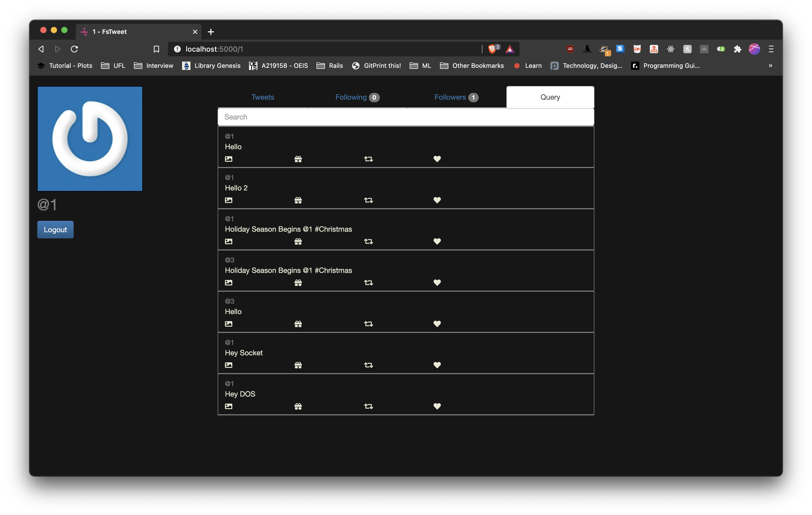
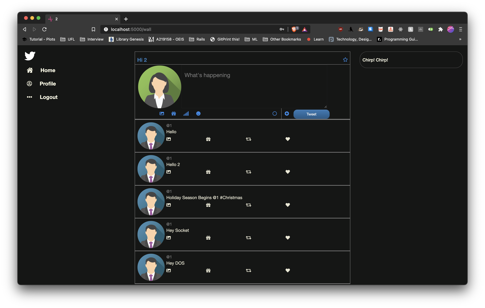

<h1 align="center"> Twitter Simulator </h1>  

## Table of Contents

- [Table of Contents](#table-of-contents)
- [Build Process](#build-process)
- [What is Working](#what-is-working)
- [API Details](#api-details)
  - [Open Endpoints](#open-endpoints)
  - [Endpoints that require Authentication](#endpoints-that-require-authentication)
  - [User](#user)
  - [UserProfile](#userprofile)
  - [Websocket APIs](#websocket-apis)
- [Screenshots](#screenshots)
  - [Index](#index)
  - [Login](#login)
  - [Signup](#signup)
  - [Subscribe](#subscribe)
  - [User Profile](#user-profile)
  - [Query Page](#query-page)
  - [User Feed Page](#user-feed-page)
- [Video Link](#video-link)

## Build Process

- Unzip file `unzip NegiYadav.zip`
- `dotnet build src/FsTweet.Web/FsTweet.Web.fsproj` to build project
- Since this project makes use of Postgres Databae, you'd need to load the dump using `psql -U postgres database < dump_file` to load all the schema necessary for this project
- `dotnet run --project src/FsTweet.Web/FsTweet.Web.fsproj` to run the project
- Visit `localhost:5000` to view this project

## What is Working

- Register account
- Send a tweet. Tweets can have hashtags (e.g. #COP5615isgreat) and mentions (@bestuser)
- Subscribe to user's tweets
- Re-tweets (so that your subscribers get an interesting tweet you got by other means)
- Allow querying tweets subscribed to, tweets with specific hashtags, tweets in which the user is mentioned (my mentions)
- If the user is connected, deliver the above types of tweets live (without querying)

## API Details

### Open Endpoints

Open endpoints require no Authentication.

* Login : `POST /login/`

### Endpoints that require Authentication

Closed endpoints require a valid Token to be included in the header of the
request. A Token can be acquired from the Login view above.

### User

Each endpoint manipulates or displays information related to the User whose
Token is provided with the request:

* Show signup page : `GET /signup`
* Create User for login : `POST /user/`
* Signup success: `GET /signup/success/%s`
* Logout: `GET /logout`

### UserProfile

`%s` means it accepts a username of type string

* Show user profile page : `GET /%s`
* Get timeline view : `GET /wall/`
* Get all the followers : `GET /followers/`
* Get all the user that it follows : `GET /followees/`
* Create Tweet/Retweet : `POST /tweets/`
* Fetch all the tweets in system : `GET /all/`
* To follow a user: `POST /follow`

### Websocket APIs

* Get live tweets: `GET /websocket`

## Screenshots
### Index

### Login

### Signup

### Subscribe

### User Profile

### Query Page

### User Feed Page

## Video Link

* [Part 1](https://youtu.be/howw-f1rGaE)
* [Part 2](https://youtu.be/hixpPvie51o)